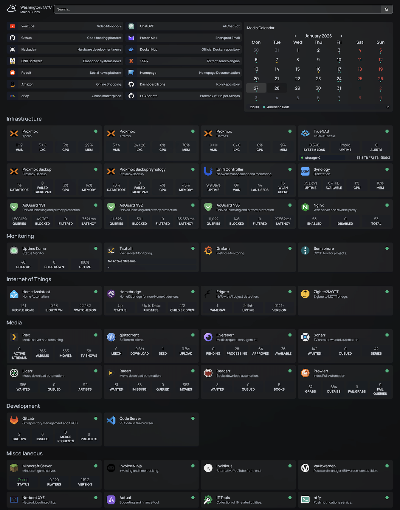

# Homepage

A full run-down of my Homepage dashboard configuration.

Much of this was built ontop of configuration provided by [techno-tim](https://github.com/techno-tim) and his [YouTube video](https://youtu.be/mC3tjysJ01E?si=O5Pk5-9jzgyePVJL) on Homepage. Do go check his channel out. It is a wonderful resource.

## Deploy

Using docker compose:

```yaml
services:
  homepage:
    image: ghcr.io/gethomepage/homepage:latest
    container_name: homepage
    env_file:
      - path: .env
    ports:
      - 3000:3000
    volumes:
      - ./config:/app/config
      - ./images:/app/public/images
      - /var/run/docker.sock:/var/run/docker.sock
    restart: unless-stopped
```

Use a `.env` to set all necessary environment variables.

## Preview:



